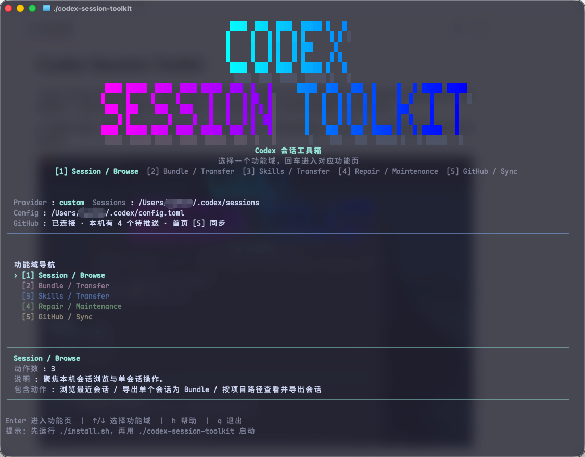

# Codex Session Toolkit

`Codex Session Toolkit` 是一个 TUI 优先的 Codex 会话工具箱。它围绕本地 `./codex_bundles/` 工作区，把 Codex Desktop / CLI 会话和自定义 Skills 做成可浏览、可校验、可导入、可同步的 Bundle。

项目的核心不是“直接操作 GitHub”或“替代 Codex”，而是把跨设备会话迁移这件事工程化：先在本地形成 Bundle，再按需要导入、修复、备份或同步到一个独立的 GitHub Bundle 仓库。



## 解决什么问题

Codex 的会话数据、Desktop 索引、CLI rollout、history、项目路径、自定义 Skills 和跨设备文件，天然分散在不同位置。这个工具解决的不是某一个单点命令，而是把这些分散内容变成一套可浏览、可导出、可导入、可修复、可同步的工程化工作流。

- **会话管理缺少统一入口**：在 TUI 中浏览 Desktop / CLI 会话，查看标题、provider、cwd、rollout 路径、history 和详情，不需要手动翻 `~/.codex/`。
- **跨设备迁移缺少稳定中间层**：把会话导出为 Bundle，按机器、分类、项目和时间归档；目标机器再从 Bundle 导入，而不是直接复制散落的原始状态文件。
- **项目级会话迁移容易混乱**：支持按项目路径筛选和批量导出，导入时可以把源机器 cwd 映射到当前机器的项目路径。
- **会话和 Skills 的关系需要可控**：会话 Bundle 只携带实际依赖的自定义 Skills；全量自定义 Skills 通过 standalone Skills Bundle 独立迁移。
- **多设备 Bundle 需要同步机制**：`./codex_bundles/` 可以连接到一个独立 GitHub Bundle 仓库，支持状态检查、Pull、Push、远端更新时间检测和冲突保护。
- **GitHub 网络慢需要可控代理**：同步中心可以连接或断开本机代理接口，让状态检查、Pull 和 Push 走代理线路。
- **导入后 Desktop 状态需要修复**：导入和修复流程会维护 `session_index.jsonl`、Desktop `threads` 表、workspace roots、侧栏顺序、pin 状态、provider 和线程标题。
- **归档会话过多会拖慢搬运**：可以在 TUI 中预览、勾选并删除归档会话；删除时会保护同 ID 的 active 会话索引和 Desktop 线程记录。
- **写入操作需要可预演、可回退**：导出、导入、修复、清理、GitHub 同步等关键动作支持 Dry-run；导入覆盖前会备份，备份可在 TUI 中恢复。

## 项目定位

围绕这些问题，工具当前提供 5 个功能域：

1. **Session / Browse**：查看、搜索、筛选和按项目导出本机会话。
2. **Bundle / Transfer**：浏览、校验、导出和导入会话 Bundle。
3. **Skills / Transfer**：独立导出、导入和管理自定义 Skills。
4. **Repair / Maintenance**：修复 Desktop 可见性、迁移 Provider、管理备份和清理旧副本。
5. **GitHub / Sync**：把 `./codex_bundles/` 作为一个可同步工作区，连接独立 GitHub Bundle 仓库后进行 Pull / Push。

## 快速开始

### macOS / Linux

```bash
chmod +x ./install.sh ./install.command ./codex-session-toolkit ./codex-session-toolkit.command
./install.sh
./codex-session-toolkit
```

macOS 可双击：

- `install.command`
- `codex-session-toolkit.command`

### Windows

```powershell
.\install.ps1
.\codex-session-toolkit.cmd
```

也可以双击 `install.bat`。

安装脚本会在项目根目录创建隔离的 `.venv/`，不会写入系统 Python 环境。

查看版本：

```bash
./codex-session-toolkit --version
```

查看脚本和兼容 CLI 命令：

```bash
./codex-session-toolkit --advanced-help
```

## TUI 主菜单

无参数启动进入 TUI。这是项目的主入口：

```bash
codex-session-toolkit
```

主菜单按功能域组织：

1. `Session / Browse`
2. `Bundle / Transfer`
3. `Skills / Transfer`
4. `Repair / Maintenance`
5. `GitHub / Sync`

### Session / Browse

用于查看、搜索、筛选和按项目导出会话。

- 浏览最近会话
- 搜索 session id、标题、预览、provider、cwd
- 查看会话详情
- 导出单个会话为 Bundle
- 按项目路径查看该项目下的会话
- 按项目批量导出全部匹配会话

项目导出路径：

```text
./codex_bundles/<machine>/sessions/project/<project>/<timestamp>/<session_id>/
```

### Bundle / Transfer

用于管理会话 Bundle。

- 浏览 `./codex_bundles/` 中的会话 Bundle
- 校验 Bundle manifest、session JSONL、history JSONL
- 导出全部 Desktop 会话
- 导出 active Desktop 会话
- 导出全部 CLI 会话
- 导入单个 Bundle 为会话
- 按 `设备 -> 分类 -> 项目` 批量导入
- 导入 project 分类时，把源机器 cwd 映射到当前机器项目目录
- 导入时维护 `session_index.jsonl`、Desktop `threads` 表、workspace roots 和侧栏状态
- 批量导入会把导入线程写入 Desktop 侧栏顺序和 workspace hint，并提升到 Desktop 最近线程池前部
- 导入到 Desktop 时会自动 pin 导入线程，避免历史会话过多时只在 TUI 可见
- 选择显示到 Desktop 时，归档来源的 Bundle 会导入为 active 会话，避免只在 TUI 可见而不出现在 Desktop 主线程栏

导入如果会覆盖本地 rollout，会先生成 `.bak.<timestamp>` 备份。

### Skills / Transfer

用于独立迁移自定义 Skills。

- 浏览本机 Skills，默认只显示自定义 Skills
- 导出单个自定义 Skill
- 导出全部自定义 Skills
- 浏览 standalone Skills Bundle
- 导入单个 Skills Bundle
- 批量导入 Skills Bundle
- 删除本机自定义 Skill，删除前确认
- 删除 Skills 列表支持 `Space` 多选、`x` 删除选中/当前、`a` 删除全部自定义 Skills

`.agents/skills/foo` 与 `.codex/skills/foo` 会按同一个相对 Skill 识别，避免重复导入。

### Repair / Maintenance

用于修复和恢复。

- 迁移到当前 Provider
- 修复会话在 Codex Desktop 中显示
- 修复 Desktop 有限最近线程池被旧记录占满、侧栏筛选/折叠状态遮挡、空 `thread_source` 和失效 `threads` 行
- 删除归档会话
- 管理会话备份
- 清理旧版无标记副本
- 可选把未登记 CLI 会话纳入 Desktop
- 支持 Dry-run 预演

Desktop 修复默认只处理 active 会话；需要 archived 会话时，从 Repair / Maintenance 的修复入口中选择对应范围。修复会备份被改动的 Desktop state、SQLite 和索引文件。

删除归档会话会先进入列表页：

- `Enter` / `d` 预览当前归档会话
- `Space` 勾选或取消勾选
- `x` 删除选中项；未勾选时删除当前项
- `a` 删除全部归档会话

删除只针对 `~/.codex/archived_sessions/` 下的归档 rollout。若同一个 session id 同时还有 active rollout，工具会保留 `session_index.jsonl` 中的 active 索引，并把 Desktop `threads` 记录指回 active 文件，避免误删后左侧线程栏丢失。

### GitHub / Sync

用于同步 `./codex_bundles/`，不用于同步项目源码。

菜单顺序：

1. `连接独立 GitHub 仓库`
2. `连接/断开代理`
3. `查看 GitHub 同步状态`
4. `从 GitHub 拉取更新`
5. `推送本机更新到 GitHub`

同步内容：

- 会话 Bundle：`sessions/`
- standalone Skills Bundle：`skills/`

同步方式：

- 连接：连接一个独立 Bundle 仓库，可选择连接后首次推送。
- 代理：配置本机代理接口；状态检查、拉取、推送都会使用它。
- 拉取：从已连接仓库拉取远端 Bundle 更新。
- 推送：提交本机 Bundle 变更，检查远端更新，必要时合并，再推送。

## GitHub 同步规则

GitHub 同步按“用户先建仓库，再连接”的方式设计。

用户需要先在 GitHub 创建一个独立仓库，例如：

```text
git@github.com:you/codex-bundles.git
```

然后在 TUI 中进入 `GitHub / Sync -> 连接独立 GitHub 仓库` 填写仓库地址。工具会拒绝连接到当前项目源码仓库 remote。

同步对象是 `./codex_bundles/` 工作区，范围包含会话 Bundle 和 standalone Skills Bundle。它不会把 `~/.codex/` 原始会话目录直接提交到 GitHub，也不会把 Bundle 混进本项目源码仓库。

### 状态页

`查看 GitHub 同步状态` 会：

- 先快速读取本地连接状态
- 再用进度 UI 检查远端更新时间
- 显示本地提交时间、远端提交时间、本地领先数量、远端领先数量
- 显示本地待同步文件数量

普通首页、Bundle 页面、Skills 页面只读本地缓存状态，不会自动联网检查远端。

### 代理

`连接/断开代理` 用于 GitHub 同步链路。常见输入：

```text
http://127.0.0.1:7890
socks5://127.0.0.1:7890
127.0.0.1:7890
```

未写协议时默认按 `http://` 处理。配置后，状态检查、拉取和推送都会在执行 git 操作时注入代理环境；断开后停止注入。代理配置只保存在 `./codex_bundles/` 自己的 git 配置里，不会修改本项目源码仓库的 git remote，也不会写全局 git 配置。

### 拉取

`从 GitHub 拉取更新` 只使用已经连接好的 remote 和分支。TUI 中不会再要求用户重新输入仓库地址或分支。

拉取页只保留一个选择：

- 从当前 remote/branch 拉取
- Dry-run 预览
- 返回

如果本地未提交变更可能被远端覆盖，拉取会停止并提示处理本地变更。

### 推送

`推送本机更新到 GitHub` 会显示：

- 推送目标 remote/branch
- 同步范围
- 待同步变更数量
- 会话变更数量
- Skills 变更数量

推送前会检查远端更新。可自动合并时自动合并；发生文件冲突时停止并列出冲突文件。

### Dry-run 返回逻辑

支持预演的 TUI 动作都遵循同一个交互规则：

1. 用户进入选择页。
2. 选择 Dry-run。
3. 查看预演结果。
4. 按 Enter 回到刚才的选择页。
5. 用户可以继续选择直接执行或返回。

这个逻辑覆盖 GitHub 拉取、GitHub 推送、GitHub 连接、项目导出、Desktop 修复、Provider 迁移和清理旧副本等流程。

## 常见流程

### 导出某个项目的会话

1. 进入 `Session / Browse`。
2. 选择 `按项目路径查看并导出会话`。
3. 粘贴项目根目录。
4. 查看匹配到的会话。
5. 按 `x` 批量导出。
6. 第一次可先 Dry-run。

### 从另一台机器导入项目会话

1. 把另一台机器的 `./codex_bundles/` 拷贝过来，或从独立 GitHub Bundle 仓库拉取。
2. 进入 `Bundle / Transfer`。
3. 选择 `批量导入 Bundle 为会话`。
4. 依次选择 `设备 -> project 分类 -> 项目文件夹`。
5. 查看工具识别出的当前机器项目路径。
6. 必要时修改目标项目路径。
7. 选择是否自动创建缺失目录。
8. 执行导入。

导入不会强制进入 GitHub 拉取流程。用户手动拷贝 Bundle 后，可以直接导入。

### 同步自定义 Skills

源机器：

1. 进入 `Skills / Transfer`。
2. 选择 `导出全部自定义 Skills`。
3. 得到 `./codex_bundles/<machine>/skills/all/<timestamp>/`。

目标机器：

1. 进入 `Skills / Transfer`。
2. 选择 `导入单个 Skills Bundle` 或 `批量导入 Skills Bundle`。
3. 内容一致的 Skill 会直接复用。
4. 内容冲突默认跳过，不覆盖本机版本。

### 找回导入覆盖前的会话

1. 进入 `Repair / Maintenance`。
2. 选择 `管理会话备份`。
3. 按 `/` 搜索 session id、provider、cwd 或路径。
4. 按 `d` 查看详情。
5. 按 `r` 恢复选中备份。
6. 按 `x` 删除不再需要的备份。
7. 输入 `DELETE` 二次确认。

恢复前如果当前 rollout 仍存在，工具会再生成一份 `rollout-xxx.jsonl.bak.restore.<timestamp>`。

### 清理归档会话

1. 进入 `Repair / Maintenance`。
2. 选择 `删除归档会话`。
3. 按 `Enter` 或 `d` 预览当前会话。
4. 按 `Space` 勾选多条，或直接停在某条上按 `x` 删除当前条。
5. 需要清空归档时按 `a`，确认后删除全部归档会话。

这个功能用来减轻跨设备同步和搬运负担。它只删除归档 rollout；如果本机还有同 ID 的 active rollout，会保留 active 索引和 Desktop 可见性。

## Bundle 目录策略

所有新版 Bundle 动作都围绕当前项目目录下的 `./codex_bundles/` 工作区进行。

默认目录：

- Codex 数据目录：`~/.codex/`
- Bundle 工作区：`./codex_bundles/`

默认结构：

```text
./codex_bundles/<machine>/sessions/single/<timestamp>/<session_id>/
./codex_bundles/<machine>/sessions/desktop/<timestamp>/<session_id>/
./codex_bundles/<machine>/sessions/active/<timestamp>/<session_id>/
./codex_bundles/<machine>/sessions/cli/<timestamp>/<session_id>/
./codex_bundles/<machine>/sessions/project/<project>/<timestamp>/<session_id>/
./codex_bundles/<machine>/skills/single/<timestamp>/
./codex_bundles/<machine>/skills/all/<timestamp>/
```

`<machine>` 默认来自当前电脑主机名。需要手动指定时，可在导出前设置：

```bash
export CST_MACHINE_LABEL=My-MacBook
```

兼容旧布局：

- `./codex_sessions/`
- `./codex_sessions/bundles/`
- `./codex_sessions/desktop_bundles/`

新导出默认只写入 `./codex_bundles/`。

## Bundle 内容

会话 Bundle 默认包含：

- `codex/<relative rollout path>.jsonl`
- `history.jsonl`
- `manifest.env`
- `skills_manifest.json`，可选
- `skills/`，可选，只包含本会话实际依赖的自定义 Skill 文件

standalone Skills Bundle 默认包含：

- `manifest.env`
- `skills_manifest.json`
- `skills/`

project 分类额外记录：

- 导出项目名
- 导出项目原路径
- 每个会话的原始 `cwd`

## Skills 搬运规则

会话导出时，工具会读取会话上下文中的 `<skills_instructions>`，区分“可用 Skill”和“实际使用过的 Skill”。

- 实际使用过的自定义 Skill 会完整打包到 `skills/`
- 可用但未使用的 Skill 只记录元数据
- 系统 Skill 和运行时 Skill 只记录元数据

导入时默认是 `best-effort`：

| 状态 | 行为 |
|---|---|
| 本机不存在 | 从 Bundle 恢复 |
| 本机已存在且内容一致 | 直接复用 |
| 本机已存在但内容不同 | 跳过，不覆盖 |
| 会话依赖但 Bundle 未携带 | 记录 missing，不阻塞 |

`--skills-mode` 可选：

| 模式 | 行为 |
|---|---|
| `best-effort` | 默认模式，尽量恢复，冲突和缺失记录为 warning |
| `strict` | 缺失、冲突或异常时中止 |
| `skip` | 完全不处理 Skills |
| `overwrite` | 允许覆盖本机已有 Skill |

批量导入会生成 Skills 恢复报告，通常位于：

```text
./codex_bundles/_skills_restore_report.<timestamp>.<id>.json
```

## Provider 和 Desktop 标题

工具会尽量保留用户在 Desktop 中看到的真实标题和 provider 语义。

- 导出时优先读取源机器 Desktop `state_*.sqlite` 中的 `threads.title`
- 如果 SQLite 标题缺失，会读取 rollout 中的 `thread_name_updated` 事件作为真实短标题
- `THREAD_NAME` 保存左侧线程短标题
- `FIRST_USER_MESSAGE` 保存第一条用户消息，作为兜底预览
- 导入时优先使用 `THREAD_NAME`
- 旧 Bundle 没有标题时，才从现有 Desktop 标题、`thread_name_updated`、`session_index.jsonl` 或 rollout 首条用户消息恢复
- 标题比较会折叠换行和多余空白，避免把同一条长提示误判成短标题
- `AGENTS.md` 注入上下文、系统技能上下文等元信息不会被当成标题
- 账号登录模式下，如果 `~/.codex/config.toml` 没有 `model_provider`，会从 Desktop `threads` 表和最新 rollout 中推断
- Desktop 修复会保留已有 Desktop 短标题；当旧标题明显是第一条提示或注入上下文时，会用 `thread_name_updated` 恢复真实短标题

如果旧会话既没有 Desktop SQLite 标题、Bundle `THREAD_NAME`，也没有 `thread_name_updated` 事件，工具只能退回到第一条有意义的用户消息或工作区/时间兜底名。这是源数据限制，不会伪造不存在的短标题。

## Desktop 侧栏可见性

Codex Desktop 左侧线程栏不只是读取 rollout 文件。它还依赖 Desktop SQLite 的 `threads` 表、全局 state 中的 workspace roots、线程到 workspace 的 hint、项目内线程顺序、pin 列表和当前侧栏筛选/折叠状态。历史记录很多时，Desktop 还会优先显示最近线程；旧的归档或失效 `threads` 行可能占住这个有限列表。

因此，本工具在导入和 `repair-desktop` 中会同时处理这些状态：

- 写入或修复 `threads` 行，并清理指向缺失/归档 managed rollout 的失效行
- 写入 workspace roots、`thread-workspace-root-hints` 和 `sidebar-project-thread-orders`
- 展开 chats / pinned / threads 分区，清除会挡住目标项目的折叠组，并把 workspace filter 切回全部
- 将导入或修复的线程提升到 Desktop 最近线程池前部
- pin 导入或修复的目标线程，让它们在会话很多时仍能出现在侧栏

Provider 识别顺序：

1. 命令显式参数
2. `~/.codex/config.toml`
3. 最新 Desktop `threads` 表
4. 最新 rollout 会话文件

## 常用按键

主界面和功能页：

| 按键 | 作用 |
|---|---|
| `↑/↓` 或 `j/k` | 移动 |
| `Enter` | 进入功能页或执行当前动作 |
| `←/→` | 切换功能页 |
| `PgUp/PgDn` | 切换功能页 |
| `h` | 打开帮助 |
| `q` | 返回或退出 |
| `0` | 直接退出 |

二级选择页：

| 按键 | 作用 |
|---|---|
| `↑/↓` 或 `j/k` | 选择执行方式、修复范围或同步方式 |
| `Enter` | 确认当前选项 |
| `q` / `←` / `Esc` | 返回上一步 |

浏览器页面：

| 按键 | 作用 |
|---|---|
| `/` | 搜索会话、Bundle、Skill 或备份 |
| `Enter` | 打开当前条目的操作面板，选择模式下直接确认 |
| `d` | 查看详情 |
| `e` | 在会话列表中导出当前会话 |
| `p` | 在项目会话浏览器中重新输入项目路径 |
| `x` | 在项目会话浏览器导出当前项目全部会话；在 Skills 列表导出全部自定义 Skills；在备份列表删除备份 |
| `Space` | 在归档会话删除列表中勾选或取消勾选 |
| `a` | 在归档会话删除列表中删除全部归档会话 |
| `s` | 切换 Bundle 导出方式 |
| `m` | 按导出机器切换 Bundle 搜索范围 |
| `l` | 切换显示全部历史 Bundle / 仅显示最新 Bundle |
| `i` / `v` | 导入当前 Bundle / 导入并自动创建缺失目录 |
| `g` | 在 Skills 列表切换是否显示系统/运行时 Skills |
| `r` | 在 Skills 列表删除自定义 Skill；在备份列表恢复备份 |

## 自动化与兼容 CLI

本项目的主产品界面是 TUI。普通迁移、导入、导出、修复、Skills 管理和 GitHub 同步都应优先从 TUI 完成，不要求用户记忆命令。

CLI 只公开少量稳定入口，用于版本检查、只读检查、Bundle 健康检查和已连接仓库后的同步脚本。旧命令仍保留兼容，但不再作为用户工作流文档化；导出、导入、Skills、修复、拉取和冲突处理都走 TUI。

```bash
codex-session-toolkit --advanced-help
```

### 稳定入口

```bash
codex-session-toolkit
codex-session-toolkit --version
codex-session-toolkit --advanced-help
codex-session-toolkit list-bundles
codex-session-toolkit validate-bundles
codex-session-toolkit sync-github --dry-run
codex-session-toolkit sync-github
```

## 安全性说明

- 不修改对话正文内容
- 不会悄悄覆盖原始 session
- 导入覆盖前会自动备份旧 rollout
- 清理操作只针对旧版无标记 clone
- 删除归档会话只处理 `~/.codex/archived_sessions/`
- 删除归档会话时，如果同 ID active 会话仍存在，会保留 active 索引和 Desktop 线程记录
- 删除 Skill 和删除备份都需要确认
- 导入前会校验 manifest、路径和 JSONL
- GitHub 同步只处理 `./codex_bundles/`
- 父项目源码仓库通过 `.gitignore` 忽略 `codex_bundles/`
- GitHub 代理只作用于 Bundle 同步链路，不写全局 git 配置
- 建议写入型动作第一次都先 Dry-run

## 运行环境

- Python >= 3.8
- 无第三方运行时依赖
- 支持 macOS / Windows / Linux
- GitHub 同步需要本机可用的 `git`

## 环境变量

| 变量 | 作用 |
|---|---|
| `NO_COLOR=1` | 禁用颜色 |
| `CST_ASCII_UI=1` | 使用 ASCII UI |
| `CST_TUI_MAX_WIDTH=120` | 限制 TUI 最大宽度 |
| `CST_MACHINE_LABEL=My-MacBook` | 指定导出时的机器标签 |
| `CST_LAUNCH_MODE=auto|source|installed` | 控制 launcher 使用源码模式或安装模式 |

## 开发验证

```bash
python3 -m ruff check src tests
python3 -m compileall -q src tests
python3 -m unittest discover -s tests -v
```

## 社区支持

<div align="center">

**学 AI，上 L 站**

[](https://linux.do/) [](https://linux.do/)

本项目在 [LINUX DO](https://linux.do/) 社区发布与交流，感谢佬友们的支持与反馈。

</div>

## 许可证

MIT License. See [LICENSE](./LICENSE).
